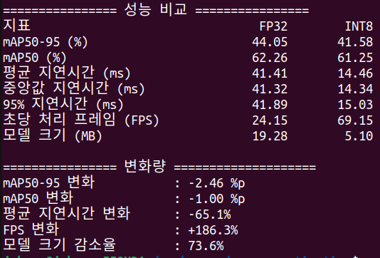

# YOLOX-Tiny INT8 양자화 및 Raspberry Pi 4 성능 비교

YOLOX-Tiny ONNX 모델을 INT8로 양자화하고, Raspberry Pi 4 CPU 환경에서 FP32와 INT8의 정확도와 추론 성능을 비교한 엣지 AI 경량화 프로젝트입니다.

---

## 1. 프로젝트 목표

- YOLOX-Tiny FP32 ONNX 모델을 INT8로 양자화
- Raspberry Pi 4에서 FP32 / INT8 성능 비교
- 정확도 손실과 지연시간, FPS, 모델 크기 변화 확인
- 도로 주행 영상에서 양자화 전후 탐지 결과 시각화

```text
YOLOX-Tiny FP32 ONNX
        ↓
Static PTQ
        ↓
YOLOX-Tiny INT8 ONNX
        ↓
Raspberry Pi 4 CPU 추론
        ↓
정확도 / 지연시간 / FPS / 모델 크기 비교
```

---


---

## 2. 성능 비교



COCO128을 사용해 FP32와 INT8 모델을 동일한 조건에서 평가했습니다.


### INT8 적용 결과

- mAP50-95: `-2.46 %p`
- mAP50: `-1.00 %p`
- 평균 지연시간: `65.1% 감소`
- FPS: `186.3% 증가`
- 모델 크기: `73.6% 감소`

정확도 손실을 비교적 작게 유지하면서, CPU 추론 속도와 모델 크기를 크게 개선했습니다.

> mAP 결과는 COCO128 기준입니다. KITTI 도로 주행 영상은 시각적 객체 탐지 데모 용도로 사용했습니다.

---


---

## 3. 모델 특성

### YOLOX-Tiny

- 입력 크기: `416 × 416`
- COCO pretrained weight 사용
- ONNX Runtime CPU inference
- FP32 / INT8 동일 전처리 및 후처리 적용

YOLOX-Tiny는 연산량이 작은 경량 객체 탐지 모델로, Raspberry Pi와 같은 제한된 엣지 환경에서 테스트하기에 적합합니다.

다만 `416 × 416` 입력 해상도는 원거리 차량처럼 작은 객체 탐지에 불리할 수 있고, COCO pretrained 모델이므로 KITTI 도로 환경에 별도로 fine-tuning된 모델은 아닙니다.

---


---

## 4. INT8 Quantization

### 적용 방식

- 방식: Static PTQ
- Quantization Format: QDQ
- Weight Type: QInt8
- Per-channel Quantization: 적용
- Calibration 방식: MinMax
- 입력 크기: `416 × 416`

FP32의 32bit 부동소수점 값을 INT8의 8bit 정수 표현으로 변환해 모델 크기와 연산 부담을 줄였습니다.

### 기대 효과

- 모델 크기 감소
- 메모리 사용량 감소
- 메모리 대역폭 부담 감소
- CPU 정수 연산을 활용한 추론 가속

### Calibration

Static PTQ에서는 activation의 양자화 범위를 정하기 위해 대표 입력 데이터가 필요합니다.

```text
Calibration Images
        ↓
Activation Range 측정
        ↓
Scale / Zero Point 결정
        ↓
INT8 Model 생성
```

이번 프로젝트는 ailia-ai ONNX Quantization 예제의 calibration 이미지를 사용해 양자화 과정을 재현했습니다.

```bash
python quantize.py     --input_model models/yolox_tiny.opt.onnx     --output_model models/yolox_tiny_quantized_int8.onnx     --calibrate_dataset calibration_images     --per_channel True
```

---


---

## 5. 하드웨어 고려사항

### Raspberry Pi 4

- ARM64 환경
- ONNX Runtime `CPUExecutionProvider` 사용
- NPU 없이 CPU에서 FP32 / INT8 직접 비교
- 평균 지연시간, P50, P95, FPS 측정

양자화 효과를 PC 수치만으로 판단하지 않고, 실제 Raspberry Pi 4 CPU에서 추론해 성능을 비교했습니다.

### PC / Raspberry Pi 환경 분리

```text
PC (x86-64)
→ 양자화 및 모델 생성

Raspberry Pi 4 (ARM64)
→ 추론 및 성능 측정
```

아키텍처와 Python 패키지 호환성이 다르기 때문에 환경을 분리했습니다.

- `requirements.txt`: PC 양자화 환경
- `requirements-rpi.txt`: Raspberry Pi 추론 환경

---


---

## 6. 도로 주행 영상 데모

KITTI 도로 주행 이미지 시퀀스를 사용해 FP32와 INT8의 탐지 결과를 비교했습니다.

시각화 클래스:

- person
- bicycle
- car
- motorcycle
- bus
- truck
- traffic light
- stop sign

### 확인한 한계

- `416 × 416` 입력으로 인해 원거리 차량이 작게 표현됨
- COCO pretrained 모델이라 KITTI 도로 환경에 최적화되지 않음
- 작은 객체에서 Bounding Box 위치가 불안정할 수 있음
- NMS 조정만으로 중복 Bounding Box를 완전히 제거하기는 어려웠음

---


---

## 7. 실행 환경

### PC

```bash
python3 -m venv .venv
source .venv/bin/activate
python -m pip install -r requirements.txt
```

### Raspberry Pi 4

```bash
python3 -m venv .venv
source .venv/bin/activate
python -m pip install -r requirements-rpi.txt
```

---


---

## 9. 개선 방향

- Calibration 데이터 확대
- 도로 주행 데이터 기반 Fine-tuning
- 입력 해상도 증가에 따른 정확도 / 지연시간 비교
- Raspberry Pi CPU thread 수에 따른 성능 비교
- NPU 환경에서 INT8 추가 가속 비교

---
